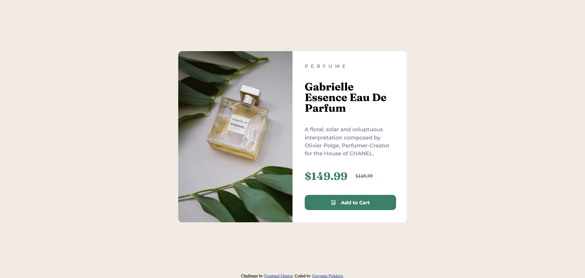

# Frontend Mentor - Product preview card component solution

This is a solution to the [Product preview card component challenge on Frontend Mentor](https://www.frontendmentor.io/challenges/product-preview-card-component-GO7UmttRfa).

## Table of contents

- [Overview](#overview)
  - [The challenge](#the-challenge)
  - [Screenshot](#screenshot)
  - [Links](#links)
- [My process](#my-process)
  - [Built with](#built-with)
  - [What I learned](#what-i-learned)
- [Author](#author)

## Overview

### The challenge

Gli utenti dovrebbero essere in grado di:

- Visualizza il layout ottimale per l'interfaccia in base alle dimensioni dello schermo del dispositivo:
  - Mobile: 375px
  - Desktop: 1440px
- Visualizza gli stati al passaggio del mouse e di messa a fuoco per tutti gli elementi interattivi sulla pagina
### Screenshot




### Links

- Solution URL: [https://www.frontendmentor.io/solutions/productpreviewcardcomponent-0haqjbKpiB](https://www.frontendmentor.io/solutions/productpreviewcardcomponent-0haqjbKpiB)
- Live Site URL: [https://gialloblink.github.io/product-preview-card-component/](https://gialloblink.github.io/product-preview-card-component/)

## My process

### Built with

- Semantic HTML5 markup
- CSS custom properties
- Flexbox
- Mobile-first workflow


### What I learned

Per questo progetto ho utilizzato background-image su un div, in modo da cambiare l'URL dell'immagine al variare delle dimensioni dello schermo.

```css
#img{
    background-image:url('images/image-product-desktop.jpg');
}

@media (max-width: 376px) {
    #img{
        background-image:url('images/image-product-mobile.jpg');
    }
}

```


## Author

- Website - [Giovanni Polidoro](https://www.giovannipolidoro.eu)
- Frontend Mentor - [@gialloblink](https://www.frontendmentor.io/profile/gialloblink)
- GitHub - [@gialloblink](https://github.com/gialloblink)